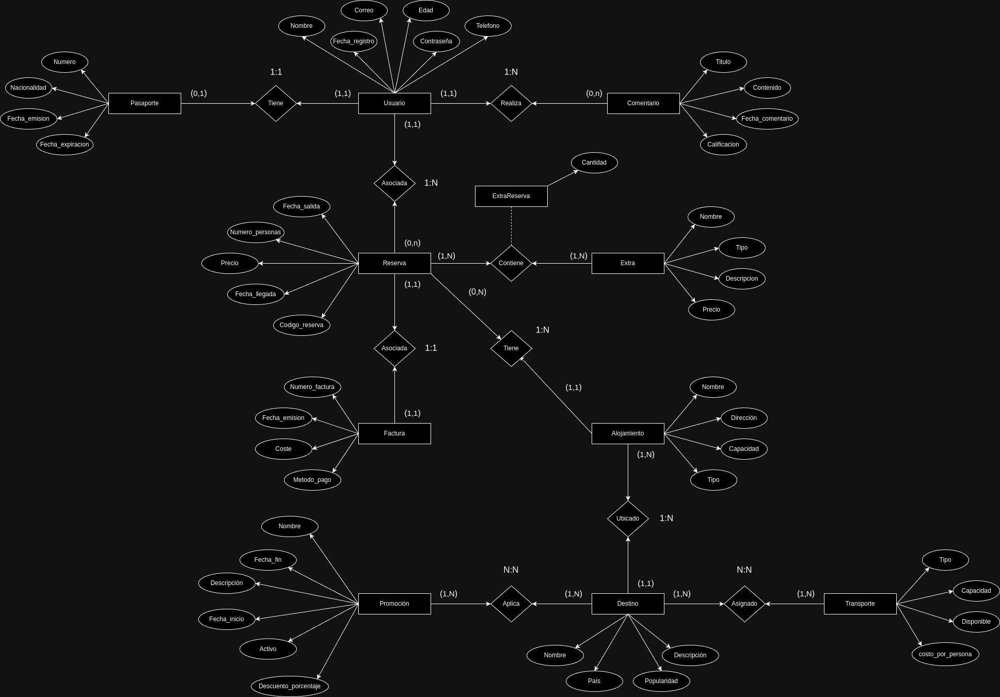

A continuación se especifica en que consiste cada modelo, cada atributo y cada parámetro usado. Y el esquema de modelo entidad-relación.

1. Usuario
El modelo Usuario representa a los usuarios que se registran en la plataforma. Sus atributos son:

- nombre: Almacena el nombre completo del usuario. Es de tipo CharField con un máximo de 200 caracteres (max_length=200, verbose_name="Nombre Completo").
- correo: Es un campo de tipo EmailField donde se guarda el correo electrónico del usuario.
- telefono: Guarda el número de teléfono del usuario. Es un CharField con un máximo de 20 caracteres (max_length=20).
- edad: Este campo almacena la edad del usuario como un entero (IntegerField).
- contraseña: Es la contraseña que el usuario utiliza para acceder a la plataforma. También es un CharField con un máximo de 200 caracteres (max_length=200).
- fecha_registro: Fecha en la que el usuario se registró. Es de tipo DateField y puede ser nulo o estar en blanco (null=True, blank=True).

2. Destino
El modelo Destino guarda información sobre los destinos turísticos disponibles. Los atributos que tiene son:

- nombre: Es el nombre del destino turístico. Este campo es de tipo CharField con un máximo de 200 caracteres (max_length=200).
- pais: Guarda el nombre del país donde se encuentra el destino. Es de tipo CharField con un máximo de 50 caracteres (max_length=50).
- descripcion: Es una descripción opcional del destino. Se almacena como TextField y puede ser nulo o estar en blanco (null=True, blank=True).
- popularidad: Es un campo de tipo FloatField donde se almacena la calificación de popularidad del destino, que debe estar entre 0 y 5. Usa validadores MinValueValidator(0) y MaxValueValidator(5)

3. Reserva
El modelo Reserva guarda información sobre las reservas hechas por los usuarios. Los atributos son:

- codigo_reserva: Es un código único para identificar cada reserva, almacenado en un CharField con un máximo de 20 caracteres (max_length=20).
- fecha_salida: Fecha y hora de salida de la reserva, se guarda como DateTimeField.
- fecha_llegada: Fecha y hora de llegada de la reserva, también un DateTimeField.
- numero_personas: Guarda el número de personas incluidas en la reserva como un entero positivo (PositiveIntegerField).
- precio: Precio total de la reserva, almacenado en un campo de tipo DecimalField con un máximo de 10 dígitos, de los cuales 2 son decimales (max_digits=10, decimal_places=2).
- usuario: Relación one-to-one con el modelo Usuario, cada reserva está asociada a un único usuario (OneToOneField(Usuario, on_delete=models.CASCADE)).

4. Comentario
El modelo Comentario almacena los comentarios que los usuarios dejan sobre destinos o reservas. Los atributos son:

- titulo: Título del comentario, almacenado en un CharField con un máximo de 100 caracteres (max_length=100).
- contenido: El contenido del comentario, de tipo TextField.
- fecha_comentario: Fecha en la que se hizo el comentario, se almacena automáticamente con la fecha y hora actual (auto_now_add=True).
- calificacion: Calificación del comentario, es un FloatField que acepta valores entre 0 y 5, con los validadores correspondientes (MinValueValidator(0), MaxValueValidator(5)).
- usuario: Relación many-to-one con el modelo Usuario, ya que un usuario puede dejar varios comentarios, pero cada comentario pertenece a un único usuario (ForeignKey(Usuario, on_delete=models.CASCADE)).

5. Alojamiento
Este modelo almacena información sobre los alojamientos disponibles en cada destino. Sus atributos son:

- nombre: Nombre del alojamiento, se guarda en un CharField de hasta 200 caracteres (max_length=200).
- direccion: Dirección del alojamiento, es un CharField de hasta 200 caracteres (max_length=200).
- capacidad: Capacidad máxima de personas que el alojamiento puede recibir, es un entero (IntegerField).
- tipo: El tipo de alojamiento (hotel, apartamento, etc.), es un CharField de hasta 50 caracteres (max_length=50).
- destino: Relación many-to-one con el modelo Destino. Varios alojamientos pueden estar en un mismo destino, pero un alojamiento pertenece a un único destino (ForeignKey(Destino, on_delete=models.CASCADE)).
- reserva: Relación many-to-one con el modelo Reserva, donde un alojamiento puede estar en varias reservas (ForeignKey(Reserva, on_delete=models.CASCADE)).

6. Extra
El modelo Extra guarda los servicios o extras disponibles para las reservas. Sus atributos son:

- nombre: Nombre del extra, guardado en un CharField de hasta 100 caracteres (max_length=100).
- tipo: Tipo de extra (actividad, guía turístico, transporte, etc.). Usa un campo de tipo CharField con opciones predefinidas (choices=TIPOS_EXTRAS, max_length=50).
- descripcion: Descripción del extra, de tipo TextField.
- precio: Precio del extra, almacenado en un DecimalField con un máximo de 8 dígitos y 2 decimales (max_digits=8, decimal_places=2).
- reserva: Relación many-to-many con el modelo Reserva usando una tabla intermedia llamada ExtraReserva (ManyToManyField(Reserva, through="ExtraReserva")).

7. Pasaporte
El modelo Pasaporte guarda la información del pasaporte de los usuarios. Sus atributos son:

- numero: Número único del pasaporte, se guarda en un CharField de hasta 50 caracteres (max_length=50, unique=True).
- fecha_emision: Fecha de emisión del pasaporte, almacenada en un DateField.
- fecha_expiracion: Fecha de expiración del pasaporte, también es un DateField.
- nacionalidad: Nacionalidad del titular del pasaporte, es un CharField con un máximo de 50 caracteres (max_length=50).

8. Transporte
Este modelo guarda información sobre los transportes disponibles para los destinos. Los atributos son:

- tipo: Tipo de transporte (bus, avión, etc.), es un CharField de hasta 50 caracteres (max_length=50).
- capacidad: Capacidad máxima de personas que pueden viajar en el transporte, es un PositiveIntegerField.
- disponible: Indica si el transporte está disponible (BooleanField(default=True)).
- costo_por_persona: Precio por persona del transporte, se almacena en un DecimalField con un máximo de 8 dígitos y 2 decimales (max_digits=8, decimal_places=2).
- destino: Relación many-to-many con el modelo Destino (ManyToManyField(Destino)).

9. Promocion
El modelo Promocion guarda las promociones aplicables a destinos o alojamientos. Los atributos son:

- nombre: Nombre de la promoción, guardado en un CharField de hasta 100 caracteres (max_length=100).
- descripcion: Descripción de la promoción, almacenada en un TextField.
- descuento_porcentaje: Porcentaje de descuento aplicado, es un FloatField con validadores que limitan el valor entre 0 y 100 (MinValueValidator(0), MaxValueValidator(100)).
- fecha_inicio: Fecha de inicio de la promoción, se guarda en un DateField.
- fecha_fin: Fecha de fin de la promoción, también es un DateField.
- activo: Indica si la promoción está activa o no, es un campo de tipo BooleanField(default=True).
- alojamiento: Relación one-to-one con el modelo Alojamiento. Una promoción solo puede aplicarse a un único alojamiento (OneToOneField(Alojamiento, on_delete=models.CASCADE)).
- destino: Relación many-to-many con el modelo Destino, ya que una promoción puede estar en varios destinos (ManyToManyField(Destino)).

10. Factura
Este modelo almacena la información de las facturas de las reservas. Los atributos son:

- numero_factura: Número único de la factura, es un CharField con un máximo de 20 caracteres (max_length=20, unique=True).
- fecha_emision: Fecha de emisión de la factura, se guarda automáticamente con la fecha actual (auto_now_add=True).
- coste: El coste total de la factura, almacenado en un DecimalField con un máximo de 10 dígitos y 2 decimales (max_digits=10, decimal_places=2).
- metodo_pago: Método de pago, que puede ser 'Tarjeta', 'Transferencia' o 'Efectivo', usando el parámetro choices (choices=METODOS_PAGO, max_length=50).
- reserva: Relación one-to-one con el modelo Reserva, ya que cada factura está asociada a una única reserva (OneToOneField(Reserva, on_delete=models.CASCADE)).

11. ExtraReserva
Este es un modelo intermedio entre Extra y Reserva, que permite la relación many-to-many entre estos modelos. Los atributos son:

- reserva: Relación many-to-one con el modelo Reserva (ForeignKey(Reserva, on_delete=models.CASCADE)).
- extra: Relación many-to-one con el modelo Extra (ForeignKey(Extra, on_delete=models.CASCADE)).
- cantidad: Almacena la cantidad de un determinado "extra" que se está reservando en relación con una reserva. Es un campo de tipo PositiveIntegerField. Se establece un valor predeterminado de 1 (default=1) para manejar casos donde solo se añada una unidad del extra.

MODELO ENTIDAD RELACIÓN

# #########################################################################################################################################################################

URLs y Vistas
A continuación se detallan todas las URLs de la aplicación, especificando lo que hace cada vista y los requisitos que cumplen.

1. URL: path('', views.index, name='index'),
- Funcionalidad: Muestra la página de inicio de la aplicación.
- Requisitos: No requiere autenticación.

2. URL: path('usuarios/listar', views.listar_usuarios, name='listar_usuarios'),
- Funcionalidad: Muestra una lista de todos los usuarios registrados en la plataforma.
- Requisitos: No requiere autenticación.

3. URL: path('usuarios/<int:id_usuario>/reservas', views.listar_reservas, name='listar_reservas'),
- Funcionalidad: Muestra todas las reservas realizadas por un usuario específico, utilizando el id_usuario proporcionado.
- Requisitos: El id_usuario debe ser un entero válido. Utiliza la relación inversa entre los modelos Usuario y Reserva.

4. URL: path('reservas/<str:fecha_inicio>/<str:fecha_fin>', views.reservas_rango, name='reservas_rango'),
- Funcionalidad: Muestra las reservas que están comprendidas entre las fechas de inicio y fin proporcionadas.
- Requisitos: Ambas fechas deben estar en formato de cadena válido. Utiliza dos parámetros de tipo str. Se usa AND para indicar que sea mayor o igual que y menor o igual que.

5. URL: re_path(r'^reservas/sin_extras/[a-zA-Z0-9]*$', views.reservas_sin_extras, name='reservas_sin_extras'),
- Funcionalidad: Muestra las reservas que no tienen ningún extra asociado.
- Requisitos: Utiliza filter para comprobar que extrareserva (tabla intermedia) sea None. En la URL usa el re_path.

6. URL: path('destinos/listar', views.listar_destinos, name='listar_destinos'),
- Funcionalidad: Muestra una lista de todos los destinos turísticos disponibles en la plataforma.
- Requisitos: No requiere autenticación.

7. URL: path('destinos/<int:id_destino>/alojamientos', views.alojamientos_destino, name='alojamientos_destino'),
- Funcionalidad: Muestra todos los alojamientos disponibles para un destino específico, utilizando el id_destino proporcionado.
- Requisitos: El id_destino debe ser un entero válido.

8. URL: path('usuarios/pasaporte/<str:nacionalidad>', views.pasaporte_nacionalidad, name='pasaporte_nacionalidad'),
- Funcionalidad: Muestra todos los usuarios que tienen la misma nacionalidad especificada en el parámetro, o aquellos cuya nacionalidad es 'Española'.
- Requisitos: Se usa el operador OR para indicar que sea de su nacionalidad o 'Española'.

9. URL: path('usuarios/ultimo_comentario/', views.ultimo_usuario_comentar, name='ultimo_usuario_comentar'),
- Funcionalidad: Muestra el último comentario realizado en la plataforma.
- Requisitos: Utiliza order_by("-fecha_comentario") y limit para obtener el último comentario.

10. URL: path('usuarios/<int:id_usuario>/comentarios', views.comentarios_usuario, name='comentarios_usuario'),
- Funcionalidad: Muestra todos los comentarios realizados por un usuario específico, utilizando el id_usuario proporcionado.
- Requisitos: El id_usuario debe ser un entero válido.

11. URL: path('reservas/total_precios', views.total_precios_reservas, name='total_precios_reservas'),
- Funcionalidad: Muestra la suma total de todos los precios de las reservas realizadas.
- Requisitos: Utiliza aggregate y Sum para calcular el precio total de las reservas.

PÁGINAS DE ERRORES

12. URL: error_404_view
- Funcionalidad: Muestra una página de error 404 personalizada.
- Requisitos: Se activa automáticamente cuando se accede a una URL no válida.

13. URL: error_403_view
- Funcionalidad: Muestra una página de error 403 personalizada.
- Requisitos: Se activa automáticamente cuando el acceso a una URL es denegado.

14. URL: error_400_view
- Funcionalidad: Muestra una página de error 400 personalizada.
- Requisitos: Se activa automáticamente para errores de solicitud incorrecta.

15. URL: error_500_view
- Funcionalidad: Muestra una página de error 500 personalizada.
- Requisitos: Se activa automáticamente para errores de servidor interno.

# #########################################################################################################################################################################

TEMPLATES APLICACIÓN WEB

ESTOS SON LOS 5 TEMPLATE TAGS QUE HE UTILIZADO:

    - FOR...EMPTY: Se utiliza para iterar sobre listas o objetos. Si la lista está vacía, se ejecuta el bloque . Lo he usado en templates como alojamientos.html, comentarios.html, destinos.html, reservas.html, usuarios.html.

    - INCLUDE: Permite incluir el contenido de otro archivo HTML dentro de la plantilla actual. Lo he usado en todas las templates que tenían un bucle for, como alojamientos.html, destinos.html, reservas.html, etc.

    - IF-ELSE: Para mostrar información condicionalmente (por ejemplo, si una reserva tiene extras asociados o si un usuario tiene comentarios registrados). Usada en la template usuarios.html, reservas.html, comentarios.html.

    - FORLOOP.COUNTER: Muestra el número de la iteración actual dentro de un bucle for. Usado en las templates alojamientos.html, destinos.html, reservas.html para mostrar el número de cada ítem listado.

    - COMMENT...ENDCOMMENT: Permite agregar comentarios en el código de la plantilla que no se muestran en el HTML renderizado. Usado para agregar comentarios explicativos dentro de las templates.

ESTOS SON LOS 5 OPERADORES QUE HE UTILIZADO:

    - LENGTH: Se utiliza para obtener la longitud de un objeto iterable (como una lista o queryset). Usado en templates como usuarios.html, reservas.html, destinos.html.

    - DEFAULT: Este operador se usa para establecer un valor por defecto si una variable no tiene valor (es None o vacía). Usado en templates como usuarios.html, comentarios.html.

    - DATE: Permite formatear fechas de acuerdo con el formato especificado. Usado en las templates reservas.html, comentarios.html.

    - UPPER: Convierte un texto a mayúsculas. Usado en las templates usuarios.html, comentarios.html.

    - LOWER: Convierte un texto a minúsculas. Usado en la template destinos.html.

ESTOS SON LOS 10 TEMPLATE FILTERS QUE HE UTILIZADO:

    - DATE: Formatear fechas.

        
Fecha de salida: {{ reserva.fecha_salida|date:"d-m-Y" }}

    - LENGTH: Obtener la cantidad de elementos de una lista.

        
Total de usuarios: {{ usuarios_mostrar|length }}

    
    - DEFAULT: Establecer un valor predeterminado si el valor es vacío.
    
        
Descripción: {{ comentario.contenido|default:"No hay contenido disponible." }}

    
    - UPPER: Convertir texto a mayúsculas.
    
        <h2>Nombre: {{ usuario.nombre|upper }}</h2>
    
    - LOWER: Convertir texto a minúsculas.
    
        <h2>Destino: {{ destino.nombre|lower }}</h2>
    
    - YESNO: Mostrar valores personalizados para booleanos.
    
        
¿Activo? {{ usuario.activo|yesno:"Sí,No" }}

    
    - TRUNCATECHARS: Limitar el texto a un número específico de caracteres.
    
        <h3>Comentario: {{ comentario.contenido|truncatechars:50 }}</h3>
    
    - PLURALIZE: Manejar el plural dinámico de las palabras.
    
        
Comentarios: {{ comentarios|length }} comentario{{ comentarios|pluralize }}

    
    - CAPFIRST: Convierte en mayúscula la primera letra.
    
        <h3>Título: {{ comentario.titulo|capfirst }}</h3>
    
    - FLOATFORMAT: Formatea números de punto flotante a un número fijo de decimales.
    
        
Precio: {{ reserva.precio|floatformat:2 }}

